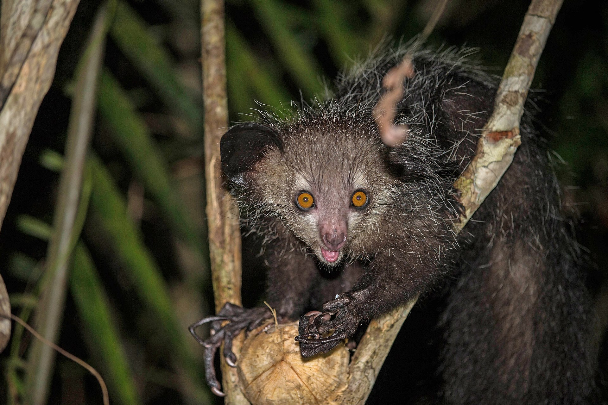

# Aye-Aye

#### (Daubentonia madagascariensis) is a long-fingered lemur, a strepsirrhine primate native to Madagascar with rodent-like teeth that perpetually grow and a special thin middle finger that they can use to catch grubs and larvae out of tree trunks.

#### It is the world's largest nocturnal primate. It is characterized by its unusual method of finding food: it taps on trees to find grubs, then gnaws holes in the wood using its forward-slanting incisors to create a small hole into which it inserts its narrow middle finger to pull the grubs out. This foraging method is called percussive foraging, and takes up 5–41% of foraging time. The only other living mammal species known to find food in this way are the striped possum and trioks (genus Dactylopsila) of northern Australia and New Guinea, which are marsupials. From an ecological point of view, the aye-aye fills the niche of a woodpecker, as it is capable of penetrating wood to extract the invertebrates within.