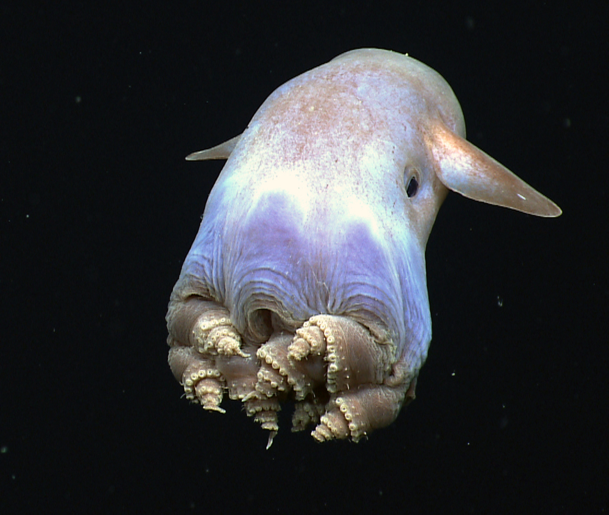

# Dumbo octopus

#### Grimpoteuthis is a genus of pelagic cirrate (finned) octopods known as the dumbo octopi. The name "dumbo" originates from their resemblance to the title character of Disney's 1941 film Dumbo, having two prominent ear-like fins which extend from the mantle above each eye. There are 17 species recognized in the genus.

#### Prey include crustaceans, bivalves, worms and copepods. The average life span of various Grimpoteuthis species is 3 to 5 years.